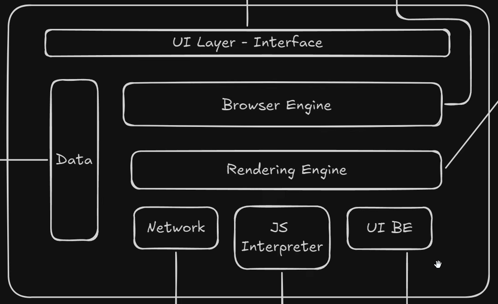
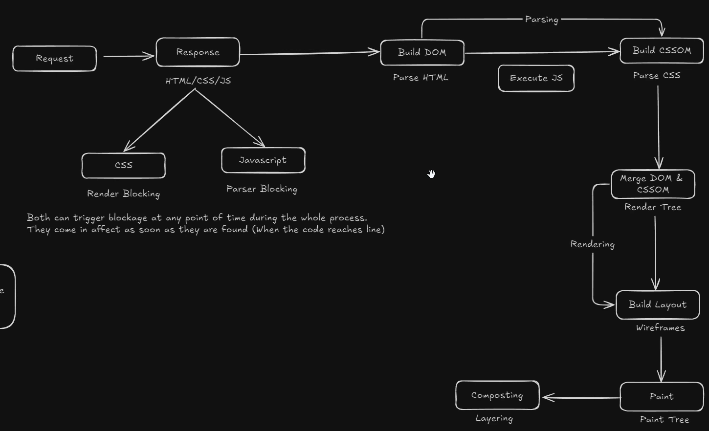

# FUNCTIONING OF BROWSER

- UI: What all we see
- Browser Engine: Mediator, UI and rendring engine in sync, interacts with data too
- Data: Cookie, Cache, Bookmarks, Sessions
- Network: Http requests, Web sockets, Web RTC{Real time transport control} - UDP like google meet
- Js Interpreter: Js code execution
- UI Backend: Basic widget and structure

---

